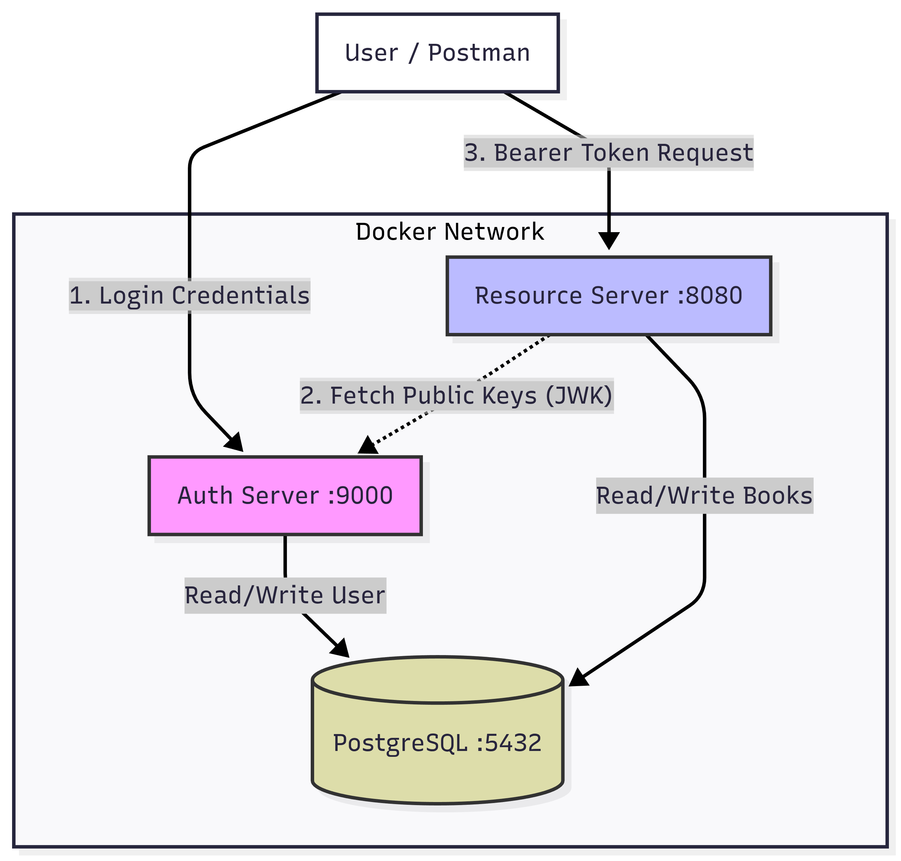
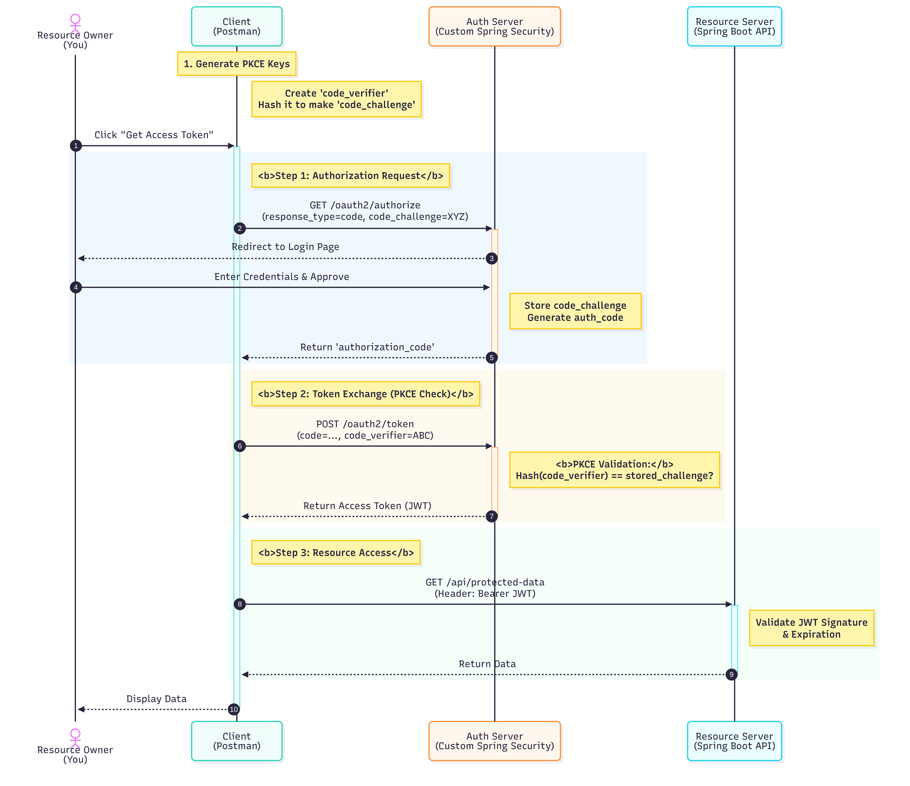
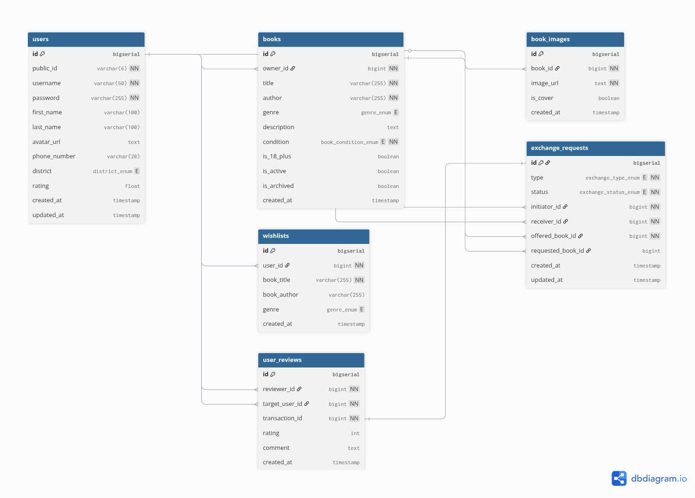

# 📚 Bookich - Distributed Library Management System

     

**Bookich** is a secure, microservices-oriented web application that separates Authentication (OAuth2) from the Resource API. It allows users to browse books and borrow them, while ensuring secure access via JWT tokens.

---

## 🏗 Architecture
The system is divided into two distinct Spring Boot applications running in Docker:

1.  **Auth Server (`:9000`)**: A dedicated OAuth2 Authorization Server. It handles user login, consent, and issues JWTs signed with RSA keys.
2.  **Resource Server (`:8080`)**: The "Bookich" API. It validates tokens and manages the business logic (Books, Owners, Transactions).
3.  **Database**: A shared PostgreSQL instance for persistent storage.

> **Key Feature:** The system uses a "Split Configuration" for Docker networking—validating tokens via `localhost` (browser context) while fetching public keys via the internal Docker network.

---

## 🚀 Technologies Used
* **Backend:** Java 17, Spring Boot 4, Spring Security 6
* **Security:** OAuth2 (OIDC), JWT, RSA Key Pairs
* **Database:** PostgreSQL, Spring Data JPA, Hibernate
* **DevOps:** Docker, Docker Compose, Maven

---
## 🧪 Testing & Quality
High code quality is a priority for this project.
* **Unit Testing:** Implemented comprehensive unit tests using **JUnit 5** and **Mockito**.
* **Coverage:** Achieved **87% code coverage**, ensuring core business logic (Services) and security filters are validated.
* **Integration Testing:** Controllers are tested using `@WebMvcTest` and `MockMvc`.


## 🛠️ Installation & Setup

### 1. Prerequisites
* Docker Desktop installed
* Git

### 2. Run with Docker (Recommended)
You don't need Java installed to run this! Just use Docker Compose:

```bash
git clone https://github.com/crazypon/BookichSystem.git
cd BookichSystem
sudo docker compose up --build
```

[](https://web.postman.co/workspace/My-Workspace~a26908e3-2a82-45ca-85d4-e5cbba04e292/collection/34895341-0a7f4072-8aaf-4ffd-bcca-a0836696b8d8?action=share&source=copy-link&creator=34895341)

# Diagrams
### 1. Application Diagram


### 2. Security Diagram


### 3. Database Schema


## 📂 Project Structure

```text
Bookich-System/
├── docker-compose.yml       # Main system orchestrator
├── README.md                # This file
├── .env                     # (Optional) Environment variables
│
├── AuthServer/              # 🔐 OAuth2 Provider
│   ├── Dockerfile           # Multi-stage Docker build (Maven)
│   ├── pom.xml
│   └── src/
│
└── Bookich/                 # 📚 Resource API
    ├── Dockerfile           # Multi-stage Docker build (Maven)
    ├── pom.xml
    └── src/
```